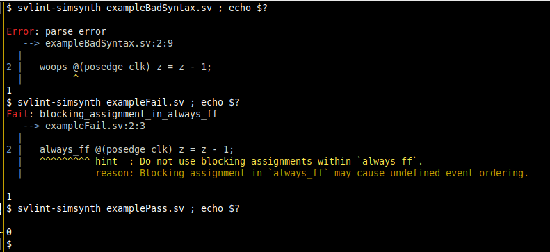
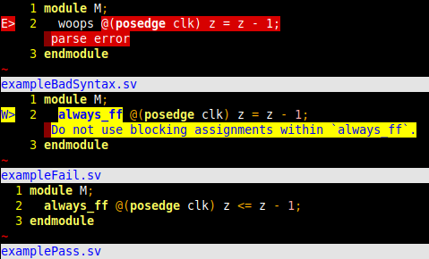
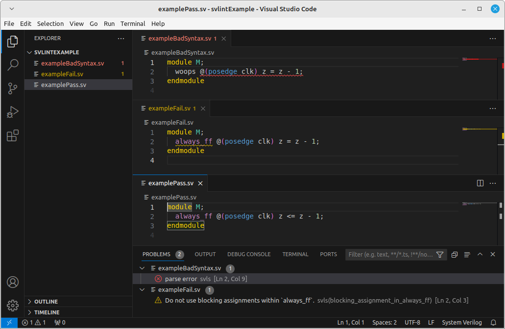
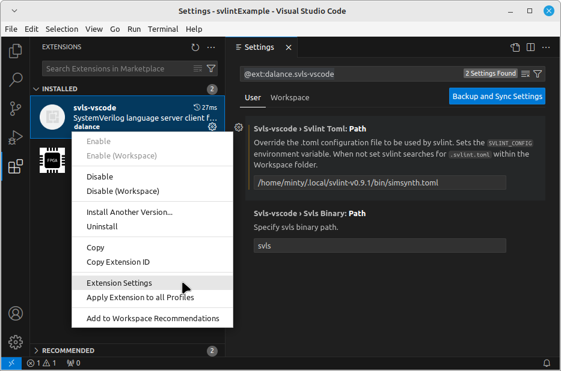

---
title:
- Introducing Svlint
author:
- Dave McEwan
date:
- Thursday 18th January 2024
theme:
- CambridgeUS
colortheme:
- seahorse
---

# Background and Motivation

## What is SystemVerilog?
- SystemVerilog is (arguably) 2 languages.
  - The preprocessor language describes text transformation, vaguely specified
    in IEEE Std. 1800-2017 Clause 22 Compiler directives.
  - The main language aims to unify hardware design, specification, and
    verification, formally specified with Backus-Naur Form notation in
    IEEE Std. 1800-2017 Annex A.
- Annex A only describes the syntax (valid sequences of characters),
  not the semantics (what the text actually means); semantics are described
  in the rest of the LRM.
- Anybody working with code can tell you there is better/good code, and there
  is worse/bad code, and everybody's opinion is slightly different.
  - Either may synthesize to a correct circuit.
  - Sometimes difficult to pin down exactly what makes you classify code as
    better/good or worse/bad.

## What is svlint?
- Command-line tool to analyse SystemVerilog source code.
- Open source SystemVerilog linter, developed on
  [GitHub](https://github.com/dalance/svlint).
  - Initally written by Naoya Hatta at
    [PEZY Computing](https://www.pezy.co.jp/), a Japanese company
    producing supercomputer chips.
  - Many contributions by myself and several private
    [contributors](https://github.com/dalance/svlint/blob/master/CONTRIBUTING.md#contributors),
    both professional and individual.
- Written in Rust, adhering to modern best-practices in software development.
  - Released versions, SemVer compatibility, easy installation on Linux, MacOS,
    and Windows, testing with continuous integration, printable manual etc.
- Contributions welcome in whatever form you can!
- Faster than commercial linters, but be aware of limitations.

## What is a linter?
*A linter is a tool which classifies pieces of code as allowed or forbidden
according to a set of precise rules.*

- By default (without lint checks), every language feature is allowed - but
  tools vary widely in their levels of support and compliance.
- You can't avoid pinning down of what's allowed/good vs forbidden/bad.
- What is good vs bad depends on who is deciding and context, e.g. design teams
  vs verif teams.
- Rules can be applied at different levels of analysis (before preprocessor,
  parsing, compilation, elaboration, etc.).


# Operation

## How svlint works
1. Iterate over source lines, applying text rules to each in turn.
2. Preprocess source then parse into a
   [`SyntaxTree`](https://docs.rs/sv-parser/latest/sv_parser/struct.SyntaxTree.html)
   (Rust data structure).
3. Iterate over nodes of the `SyntaxTree`, applying syntax rules to each
   in turn.

- Uses a preprocessor and parser from a related project
  [sv-parser](https://github.com/dalance/sv-parser) which adhere very
  closely to IEEE Std. 1800-2017 Clause 22 and Annex A, respectively.
- Each rule operates independently and can maintain state.
- Only violations are reported.
- Rules are pass/fail, i.e. no levels like warning, low, etc.

## Levels of SystemVerilog Analysis
- Text, before the preprocessor.
  - E.g. lines longer than 80 characters, lines with trailing whitespace,
    indented preprocessor directives, etc.
  - Called "text rules" in svlint.
- Syntax, i.e. after parsing.
  - E.g. blocking assignment under `always_ff`, identifier that violates naming
    conventions, `if` without matching `else`.
  - Called "syntax rules" in svlint.

------------------ svlint stops here ------------------

- Semantics of a single `module`/`package`/etc., i.e. compilation.
  - E.g. variable undeclared before use, constants unresolved, etc.
  - Analoguous to compiled object files.
- Semantics of combined `module`s/`package`s/etc., i.e. elaboration.
  - E.g. unconnected ports, hierarchy too deep, etc.
  - Analoguous to linked executables.

## Examples of Text and Syntax Rules
- Text
  - [`style_textwidth`](https://github.com/dalance/svlint/blob/master/md/textrules-explanation-style_textwidth.md)
  - [`header_copyright`](https://github.com/dalance/svlint/blob/master/md/textrules-explanation-header_copyright.md)
- Syntax
  - [`blocking_assignment_in_always_ff`](https://github.com/dalance/svlint/blob/master/md/syntaxrules-explanation-blocking_assignment_in_always_ff.md)
  - [`localparam_type_twostate`](https://github.com/dalance/svlint/blob/master/md/syntaxrules-explanation-localparam_type_twostate.md)
  - [`style_operator_boolean`](https://github.com/dalance/svlint/blob/master/md/syntaxrules-explanation-style_operator_boolean.md)
  - [`re_forbidden_port_input`](https://github.com/dalance/svlint/blob/master/md/syntaxrules-explanation-re_forbidden_port_input.md)
  - [`re_required_port_input`](https://github.com/dalance/svlint/blob/master/md/syntaxrules-explanation-re_required_port_input.md)
  - [`prefix_input`](https://github.com/dalance/svlint/blob/master/md/syntaxrules-explanation-prefix_input.md)


## TOML Configuration 1of2
- A [TOML](https://toml.io/en/) file defines which set of rules are enabled,
  i.e. a *ruleset*, together with the values of any options they use.
- The file is given by environment variable `SVLINT_CONFIG`.
  - Ideal for large projects distributed across a filesystem.
  - Ideal for teams using
    [Environment Modules](https://modules.sourceforge.net/).
- Alternatively found by searching up the hierarchy (from the current working
  directory) for a file called `.svlint.toml`.
  - Ideal for small projects contained in one git repository.
- In the
  [MANUAL](https://github.com/dalance/svlint/blob/master/MANUAL.md),
  syntax rules are (loosely) divided between functional, naming, and
  style/whitespace.

## TOML Configuration 2of2
```toml
# Rules without options.
textrules.style_semicolon = true
syntaxrules.blocking_assignment_in_always_ff = true

# Text rule which uses an option.
# Require all text to fit on a screen.
option.textwidth = 80
textrules.style_textwidth = true

# Syntax rule which uses an option.
# Require output ports to have a prefix.
option.prefix_output = "o_"
syntaxrules.prefix_output = true
```

## Rulesets
- Considering the effects of combining different rules is non-trivial (in terms
  of the code quality that's allowed to pass).
- Some example rulesets are bundled with svlint:
  - `parseonly`: No rules enabled, but syntax must be valid.
  - `style`: Basic set of whitespace checks.
  - `simsynth`: Find obvious risks of simulation/synthesis mismatch.
  - `designintent`: Extends simsynth to require code that means (to a
    simulator/synthesisor) what you (probably) mean.
  - `verifintent`: Like designintent, but for verification code.
  - `DaveMcEwan-*`: My personally preferred configurations.
- You don't need to use these, but you can build from them.
- Yes, I'll happily assist get your's included in future releases :)

## Wrapper Scripts
- Typing `SVLINT_CONFIG=.../foo.toml svlint myfile.sv` can be cumbersome.
- Instead, all bundled rulesets also have wrapper scripts so you can do
  `svlint-foo` or `svls-foo`.
- If you want additional functionality in a wrapper script, this can be added
  as part of a ruleset definition.

## Text-Editor Integration
- Most modern editors support the
  [Language Server Protocol](https://en.wikipedia.org/wiki/Language_Server_Protocol)
  to show diagnostic messages from an external tool.
  - [Vim](https://github.com/prabirshrestha/vim-lsp),
    [Neovim](https://neovim.io/doc/user/lsp.html),
    [Emacs](https://emacs-lsp.github.io/lsp-mode/),
    [VSCode](https://code.visualstudio.com/api/language-extensions/language-server-extension-guide),
    [Notepad++](https://github.com/Ekopalypse/NppLspClient).
- Svls is svlint built as a LSP server.
  - Diagnostic messages, i.e. the hints and reasons you would see running
    svlint on the command line, are supported.
  - Other features, e.g. go-to-definition, are not supported.


# Illustrations

## Sources
```systemverilog
module M; // BadSyntax
  woops @(posedge clk) z = z - 1;
endmodule
```

```systemverilog
module M; // Fail
  always_ff @(posedge clk) z = z - 1;
endmodule
```

```systemverilog
module M; // Pass
  always_ff @(posedge clk) z <= z - 1;
endmodule
```

## Command Line `svlint-simsynth`


## Vim with `vim-lsp` Plugin


## VSCode with `svls-vscode` Extension



# Thanks for Listening. Questions?


# Extra

## Features for Debugging
- `svlint-parseonly`: The empty ruleset with no rules enabled.
  Useful to quickly check for (in)valid syntax.
- `-E`: Print output from preprocessor.
  Note that every preprocessor is different!
- `--dump-filelist=yaml`: Convert a filelist into YAML.
  Useful for working with other scripts.
- `--dump-filelist=files`: Print list of all files found in a filelist.
  Alternatively, `files` could be `incdirs` or `defines`.
  Useful for checking large filelists.
- `--dump-syntaxtree`: Print your code's syntax tree.
  Useful for working through obscure error messages from other tools.

## Shell Completion
- Generate shell completion scripts with the `--shell-completion` option.
- Also supports `zsh`, `fish`, `elvish`, and `powershell`.
- Save and source the output to get TAB-completions, e.g:
```sh
svlint --shell-completion=bash \
  > ~/.bash_completion.d/svlint
echo '. "~/.bash_completion.d/svlint"' \
  >> ~/.bashrc
```

## Regex Naming Rules Are Powerful
```toml
# Require prefix on function names.
option.re_required_function = "^f_[a-zA-Z0-9_]+$"
syntaxrules.re_required_function = true

# Forbid any class from being declared.
option.re_forbidden_class = ".*"
syntaxrules.re_forbidden_class = true
```
Not only useful to enforce naming conventions.
Forbidding certain types from being declared means they can't slip through
unintended gaps in the ruleset.

## Simple Installation
- Download a [release](https://github.com/dalance/svlint/releases/tag/v0.9.1)
  for your platform (Linux, Windows, MacOS) and unzip/extract.
  - `doc/` contains the PDF manual.
  - `bin/` contains the statically linked `svlint` binary, wrapper scripts
    (POSIX shell and Windows batch), and their TOML configurations.
- Add the `bin/` directory to your `PATH`, perhaps using an environment module
  like this:

```tcl
#%Module
module-whatis "SystemVerilog linter."
prepend-path PATH "/cad/tools/svlint-v0.9.1/bin"
```

## Live Demo: Syntax Checking a Collecton of Files
- Show `svlint-parseonly` checking `example/*.sv`
- Commands:
  - `time svlint-parseonly -v *.sv`

## Live Demo: Examples of Ruleset Violations
- Show `svlint-designintent`.
- Re-show with `--github-actions` for CI compatibility.
- Re-show with `-1`/`--oneline` for compact output, compatible with `wc -l`.
- Commands:
  - `time svlint-designintent -v *.sv`
  - `svlint-designintent --github-actions Example.sv`
  - `svlint-designintent --oneline Example.sv`
  - `svlint-designintent --oneline Example.sv | wc -l`

## Vim Configuration
```vim
" ~/.vimrc
if executable('svls-simsynth')
  au User lsp_setup call lsp#register_server({
    \ 'name': 'svls-simsynth',
    \ 'cmd': {server_info->['svls-simsynth']},
    \ 'whitelist': ['systemverilog'],
    \ })
  let g:lsp_diagnostics_virtual_text_enabled = 1
  let g:lsp_diagnostics_signs_enabled = 1
  let g:lsp_log_file = expand('~/.vim-lsp.log')
endif
```

## VSCode Configuration


